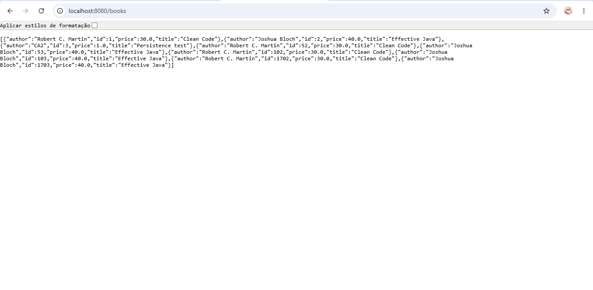
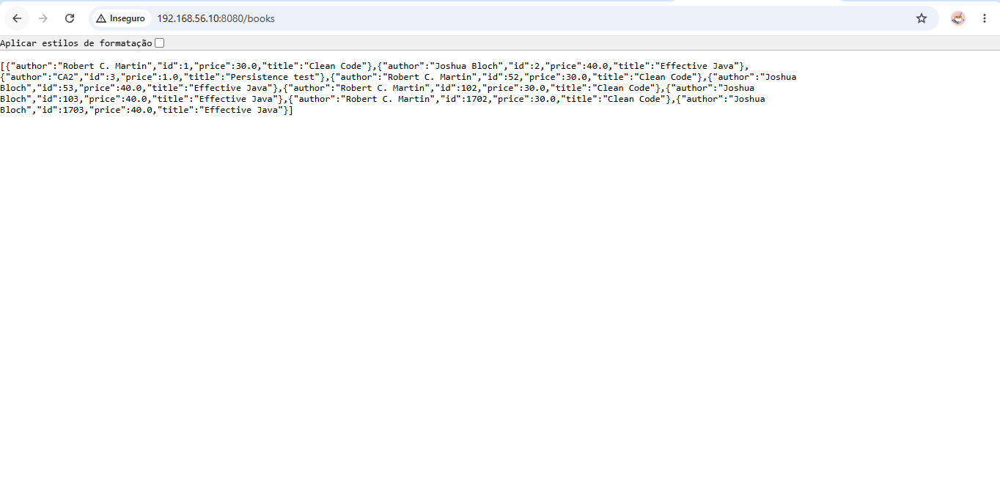
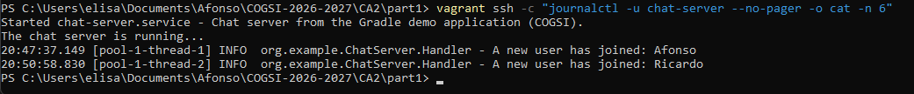
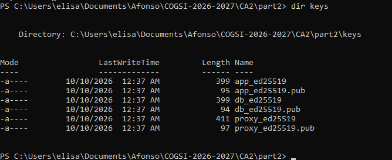
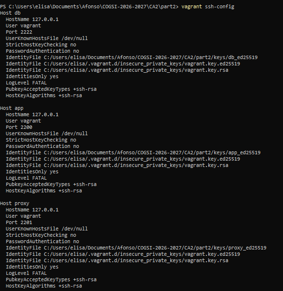
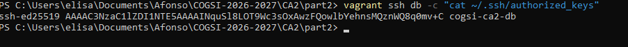
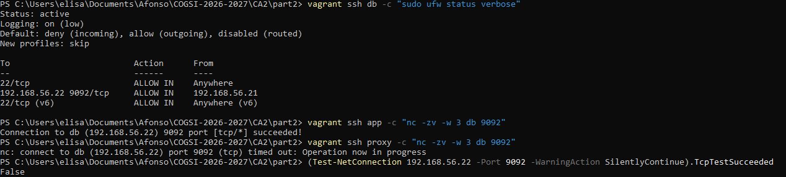
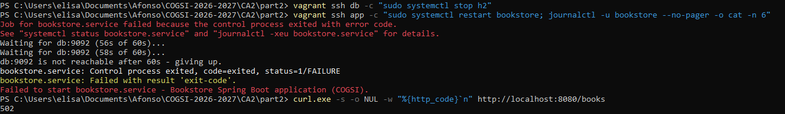
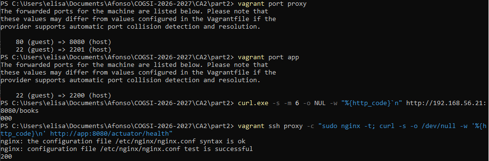

# CA2 - Virtualization with Vagrant

Technical report for the second class assignment (CA2) of Configuracao e Gestao
de Sistemas (COGSI), Mestrado em Engenharia Informatica, Instituto Superior de
Engenharia do Porto.

- Topic: virtualization with Vagrant.
- Group repository: `Af-Oliveira/COGSI-2026-2027`.
- Milestone tags: `ca2-part1`, `ca2-part2`.
- Applications: the two CA1 projects - the Gradle demo chat application
  (`CA1/part1`) and the Bookstore Spring Boot application built with Gradle
  (`CA1/part2`).

This report follows a tutorial style: each requirement of the assignment is
quoted before the steps that implement it, the commands, the output they
produced and the explanation. Executing the instructions in order reproduces
the assignment.

---

## Table of contents

1. [Overview](#1-overview)
2. [Environment and prerequisites](#2-environment-and-prerequisites)
3. [Repository layout](#3-repository-layout)
4. [Operative guidelines](#4-operative-guidelines)
5. [Part 1 - First week](#5-part-1---first-week)
6. [Part 2 - Second week](#6-part-2---second-week)
7. [References](#7-references)

---

## 1. Overview

Part 1 runs the two CA1 projects inside a single virtual machine created with
Vagrant. One `vagrant up` creates an Ubuntu 24.04 VM, installs the project
dependencies, clones the group repository, builds both applications and starts
them as services:

| Application | Runs in the VM as | Guest port | Used from the host with |
| --- | --- | --- | --- |
| Bookstore (Spring Boot) | `bookstore.service` | 8080 | browser or `curl` on `http://localhost:8080` |
| Chat server (Gradle demo) | `chat-server.service` | 59001 | the chat clients, `./gradlew runClient` |

The Bookstore stores its H2 database on disk, in a synced folder dedicated to
the database, so the data survives a restart and even the destruction of the
VM.

Part 2 splits the Bookstore into three machines on a private network: `db`
runs the H2 engine in server mode, `app` runs the Spring Boot application as a
JDBC client of that server, and `proxy` runs Nginx as the only entry point.
Each machine has its own SSH key, firewalls restrict who can talk to whom, and
the application waits for the database port before it starts.

---

## 2. Environment and prerequisites

The work was performed with the tools below.

| Tool | Version | Purpose |
| --- | --- | --- |
| Host | Windows 11 Home, x86-64, 16 GB RAM | Runs the hypervisor and the chat clients. |
| VirtualBox | 7.2.20 | Provider: supplies the virtualization. |
| Vagrant | 2.4.9 | Creates, provisions and manages the VM. |
| Box | `bento/ubuntu-24.04` 202510.26.0 | Base image (Ubuntu 24.04.3 LTS, kernel 6.8.0-86). |
| Git / GitHub CLI | git 2.43 / gh 2.46 | Branches, tags, issues and pull requests. |

On Windows, VirtualBox and Vagrant can be installed with `winget`:

```bash
# install the provider and Vagrant
winget install --id Oracle.VirtualBox -e
winget install --id Hashicorp.Vagrant -e

# confirm the installed versions
vagrant --version
VBoxManage --version
```

```console
Vagrant 2.4.9
7.2.20r175154
```

> - `winget install --id ... -e` installs the package with that exact
>   identifier.
> - `vagrant --version` and `VBoxManage --version` print the installed
>   versions. `VBoxManage` is in `C:\Program Files\Oracle\VirtualBox`.
> - Vagrant is not a hypervisor: it drives a provider (VirtualBox here), which
>   is why both are required.

Two characteristics of the host influenced the results and are referenced in
the sections below.

- The host has WSL 2 enabled, so the Windows hypervisor (Hyper-V) is active
  and VirtualBox cannot use VT-x directly. It falls back to the Hyper-V API,
  which is slower. All the output in this report was captured with one virtual
  CPU (`VM_CPUS=1`) for the reason explained in
  [section 5.10](#510-problems-found-and-how-they-were-solved).
- The commands were issued from a WSL shell that calls the Windows
  `vagrant.exe`. Environment variables are only passed from WSL to a Windows
  process when they are listed in `WSLENV` (for example
  `WSLENV=VM_CPUS:START_SERVICES`). In PowerShell or in a native Linux or
  macOS shell this is not needed.

---

## 3. Repository layout

```text
COGSI-2026-2027/
├── README.md                 (repository root)
├── CA1/                      (the two applications used by this assignment)
│   ├── part1/                (Gradle demo chat application)
│   └── part2/                (Bookstore Spring Boot application, Gradle)
└── CA2/
    ├── README.md             (this technical report)
    ├── .gitignore            (.vagrant/ and the H2 database files)
    ├── .gitattributes        (LF line endings for files that run in the guest)
    ├── assets/               (screenshots used in this report)
    │   ├── part1/            (Part 1 screenshots embedded below)
    │   ├── part2/            (Part 2 screenshots embedded below)
    │   └── AllScreenShots/   (every screenshot taken while testing both parts)
    ├── part1/
    │   ├── Vagrantfile
    │   ├── provisioning/
    │   │   ├── base.sh       (project dependencies)
    │   │   ├── clone.sh      (clone or update the group repository)
    │   │   ├── build.sh      (build both applications)
    │   │   ├── deploy.sh     (artifacts, H2 configuration, systemd units)
    │   │   └── start.sh      (start the services, on every boot)
    │   └── h2-data/          (synced folder dedicated to the H2 database)
    └── part2/
        ├── Vagrantfile       (db, app and proxy machines)
        ├── provisioning/
        │   ├── base.sh       (common tools and /etc/hosts, all machines)
        │   ├── ssh-key.sh    (custom SSH key, all machines)
        │   ├── db.sh         (H2 server and firewall)
        │   ├── app.sh        (Bookstore, health check and firewall)
        │   └── proxy.sh      (Nginx reverse proxy)
        └── keys/             (generated SSH keys, not versioned)
```

---

## 4. Operative guidelines

> Use your own group's private repository
> - Create a folder for each class assignment in the root of your repository,
>   where you should add the files specific to the assignment

The assignment lives in the `CA2/` folder, with one subfolder per part.

> Continue to operate Git via the command line
> - Create a branch for each feature and merge the completed feature into main

```bash
# create the feature branch for Part 1
git checkout -b feature/ca2-part1-vagrant
```

> - `git checkout -b` creates the branch and switches to it. Each component of
>   the assignment has its own branch (`feature/ca2-part1-vagrant`,
>   `feature/ca2-part2-multi-vm`, `feature/ca2-alternative-multipass`), merged
>   into `main` through a pull request.

> You will be using two different applications for this CA
> - Note: do not copy the .git folder from the app's original repository

The two applications are the ones already imported, without their original
history, into `CA1/part1` and `CA1/part2`. They are not copied again: the VM
obtains them by cloning the group repository.

> Create issue(s) in GitHub for your main tasks

The work is planned as a sprint. A milestone represents the sprint, labels
classify each issue, one epic groups the stories of each component, and the
user stories are attached to their epic as sub-issues.

```bash
# labels, by family (one example of each)
gh label create "sprint: CA2" --color 5319e7 --description "Sprint 2 - CA2 Virtualization with Vagrant"
gh label create "component: part1-single-vm" --color 0e8a16 --description "CA2 Part 1 - single VM running both applications"
gh label create "type: user story" --color 1d76db --description "Requirement written from the point of view of who benefits"
gh label create "area: provisioning" --color fbca04 --description "Shell provisioning scripts and idempotence"
gh label create "priority: must" --color b60205 --description "Required to meet the assignment requirements"

# the sprint
gh api repos/Af-Oliveira/COGSI-2026-2027/milestones \
  -f title="Sprint 2 - CA2 Virtualization with Vagrant" -f due_on="2026-10-18T23:59:59Z"

# one issue per epic, user story and task
gh issue create --title "Persist the H2 database in a dedicated synced folder" \
  --label "sprint: CA2,type: user story,component: part1-single-vm,area: persistence,priority: must" \
  --milestone "Sprint 2 - CA2 Virtualization with Vagrant" \
  --assignee Af-Oliveira,rmotafreitas --body-file story.md

# attach a story to its epic as a sub-issue
gh api -X POST repos/Af-Oliveira/COGSI-2026-2027/issues/10/sub_issues \
  -F sub_issue_id="$(gh api repos/Af-Oliveira/COGSI-2026-2027/issues/21 -q .id)"
```

| Label family | Values | Meaning |
| --- | --- | --- |
| `sprint:` | `CA1`, `CA2` | The assignment the issue belongs to. |
| `component:` | `part1-single-vm`, `part2-multi-vm`, `alternative`, `report` | The part of the sprint. |
| `type:` | `epic`, `user story`, `task`, `documentation`, `bug` | The kind of work. |
| `area:` | `vagrant`, `provisioning`, `networking`, `persistence`, `security`, `applications` | The technical area. |
| `priority:` | `must`, `should`, `could` | Required, expected for the higher grades, optional. |

| Epic | Issues |
| --- | --- |
| #10 Part 1 - Single VM running the CA1 applications | #14 to #23 |
| #11 Part 2 - Multi-VM environment (app, db and proxy) | #24 to #31 |
| #12 Alternative solution - managing VMs without Vagrant | #32 to #34 |
| #13 Technical report | #35 to #38 |

> - Every story states the user story, the assignment requirement it comes
>   from, its acceptance criteria, its tasks, how to verify it and the
>   definition of done.
> - `gh api .../sub_issues` links a story to its epic, so the progress of each
>   component is visible in the epic.

> Make several commits while you work (incremental, descriptive commit
> messages)

Each commit is one step of the work and references the issues it advances, so
the history can be followed from the issue to the code:

```bash
git log --oneline feature/ca2-part1-vagrant -5
```

```console
2736469 feat(ca2): start the services on every boot and expose them to the host
3645044 feat(ca2): deploy the applications with H2 persisted in a synced folder
2a5184a feat(ca2): clone the group repository and build both applications in the VM
606ce88 feat(ca2): create the Part 1 VM from a pinned box with base provisioning
4dafaa6 chore(ca2): scaffold the CA2 folder for the Vagrant assignment
```

> - The message body of each commit ends with `Refs #<issue>`, and the commit
>   that completes a story uses `Closes #<issue>`, which GitHub applies when
>   the branch is merged into `main`.

---

## 5. Part 1 - First week

> The goal of the Part 1 of this assignment is to practice with Vagrant using
> the same projects from CA1, but now inside a virtual machine

To reproduce Part 1, clone the repository on the host and bring the VM up:

```bash
git clone https://github.com/Af-Oliveira/COGSI-2026-2027.git
cd COGSI-2026-2027/CA2/part1
vagrant validate
vagrant up
```

```console
Vagrantfile validated successfully.
```

> - `vagrant validate` checks the Ruby syntax and the Vagrant settings of the
>   `Vagrantfile` without starting a VM.
> - `vagrant up` creates the VM and runs every provisioner. Its output is
>   shown step by step in the sections below. The output snippets are
>   abridged: separator lines, blank lines and repeated Gradle notices were
>   removed, and nothing else was changed.

### 5.1. Creating the VM from a pinned box

> You should start by creating a VM using Vagrant
> - Pin box version and justify box source trust

The VM is described in `CA2/part1/Vagrantfile`:

```ruby
Vagrant.require_version ">= 2.4.0", "< 3.0.0"

vm_memory = ENV["VM_MEMORY"] || "2048"
vm_cpus   = ENV["VM_CPUS"]   || "2"

Vagrant.configure("2") do |config|
  config.vm.box = "bento/ubuntu-24.04"
  config.vm.box_version = "202510.26.0"
  config.vm.box_check_update = false

  config.vm.hostname = "cogsi-ca2-part1"

  config.vm.provider "virtualbox" do |vb|
    vb.name = "cogsi-ca2-part1"
    vb.memory = vm_memory
    vb.cpus = vm_cpus
    vb.gui = false
  end

  config.vm.provider "vmware_desktop" do |vmware|
    vmware.vmx["memsize"] = vm_memory
    vmware.vmx["numvcpus"] = vm_cpus
  end
end
```

The first `vagrant up` downloads the box and creates the VM:

```console
Bringing machine 'default' up with 'virtualbox' provider...
==> default: Box 'bento/ubuntu-24.04' could not be found. Attempting to find and install...
    default: Box Provider: virtualbox
    default: Box Version: 202510.26.0
==> default: Loading metadata for box 'bento/ubuntu-24.04'
    default: URL: https://vagrantcloud.com/api/v2/vagrant/bento/ubuntu-24.04
==> default: Adding box 'bento/ubuntu-24.04' (v202510.26.0) for provider: virtualbox (amd64)
    default: Downloading: https://vagrantcloud.com/bento/boxes/ubuntu-24.04/versions/202510.26.0/providers/virtualbox/amd64/vagrant.box
==> default: Successfully added box 'bento/ubuntu-24.04' (v202510.26.0) for 'virtualbox (amd64)'!
==> default: Importing base box 'bento/ubuntu-24.04'...
==> default: Setting the name of the VM: cogsi-ca2-part1
==> default: Preparing network interfaces based on configuration...
    default: Adapter 1: nat
    default: Adapter 2: hostonly
==> default: Forwarding ports...
    default: 8080 (guest) => 8080 (host) (adapter 1)
    default: 59001 (guest) => 59001 (host) (adapter 1)
    default: 22 (guest) => 2222 (host) (adapter 1)
==> default: Booting VM...
==> default: Waiting for machine to boot. This may take a few minutes...
    default: Vagrant insecure key detected. Vagrant will automatically replace
    default: this with a newly generated keypair for better security.
==> default: Machine booted and ready!
==> default: Setting hostname...
==> default: Configuring and enabling network interfaces...
==> default: Mounting shared folders...
    default: C:/Users/elisa/Documents/Afonso/COGSI-2026-2027/CA2/part1/h2-data => /h2-data
```

```bash
# the box that was installed and the state of the machine
vagrant box list
vagrant status

# the operating system, CPUs, memory and disk seen by the guest
vagrant ssh -c 'lsb_release -ds; uname -r; nproc; free -m | sed -n 1,2p; df -h / | tail -1'
```

```console
bento/ubuntu-24.04 (virtualbox, 202510.26.0, (amd64))

Current machine states:

default                   running (virtualbox)

Ubuntu 24.04.3 LTS
6.8.0-86-generic
1
               total        used        free      shared  buff/cache   available
Mem:            1968         599        1037           1         479        1368
/dev/mapper/ubuntu--vg-ubuntu--lv   31G  5.3G   24G  19% /
```

> - `Vagrant.require_version` refuses to run with a Vagrant version outside
>   the tested range, so a team member with an incompatible version gets a
>   clear error instead of a different environment.
> - `config.vm.box_version` pins the box. Without it, Vagrant would use the
>   newest version available when each person first runs `vagrant up`, and two
>   team members could end up with different images. `box_check_update = false`
>   also stops the outdated-box check on every `vagrant up`.
> - `vm_memory` and `vm_cpus` read host environment variables with a default,
>   so the resources can be adjusted to the host without editing the file. The
>   output above shows 1 CPU because it was captured with `VM_CPUS=1`.
> - The two provider blocks apply the same resources on VirtualBox and on
>   VMware Desktop, the provider used on Apple Silicon hosts.
> - `vagrant ssh -c '<command>'` runs a command in the guest and returns.

**Why the box is trusted.** The box comes from the Bento project, which is
maintained by Progress Chef. It is not an image prepared by an unknown user:

- The Packer templates that build every Bento box are public
  (<https://github.com/chef/bento>), so what is installed in the image can be
  inspected and the box can be rebuilt from source.
- The Vagrant documentation recommends the Bento boxes as the base boxes to
  use, and the lecture material uses the same box.
- The box is published for VirtualBox, VMware and Parallels, on `amd64` and
  `arm64`, so the same `Vagrantfile` works on the machines of both team
  members.
- It is a minimal Ubuntu LTS image; everything else is installed by the
  provisioning scripts in this repository, which are under version control.

One limitation was found: the metadata of this box in Vagrant Cloud does not
publish a checksum (`checksum_type` is `none`), so Vagrant cannot verify the
downloaded file against one. The integrity of the download relies on HTTPS
and on the identity of the publisher. A team that needed a stronger guarantee
would host the box itself, or record its own checksum and enforce it with
`config.vm.box_download_checksum`.

### 5.2. Installing the project dependencies

> Automate the installation of all the dependencies of the projects (e.g., Git,
> JDK, Maven, Gradle, etc.) using a provisioning shell script

> Ensure that the provisioning process is idempotent and can be safely executed
> more than once

The dependencies are installed by `provisioning/base.sh`, an external script
run by a named provisioner:

```ruby
config.vm.provision "shell",
  name: "base_packages",
  path: "provisioning/base.sh"
```

```bash
PACKAGES=(git curl openjdk-21-jdk-headless)

missing=()
for package in "${PACKAGES[@]}"; do
    if dpkg -s "$package" >/dev/null 2>&1; then
        echo "[OK] $package is already installed."
    else
        echo "[MISSING] $package"
        missing+=("$package")
    fi
done

if [ "${#missing[@]}" -gt 0 ]; then
    echo "[INSTALL] Installing: ${missing[*]}"
    apt-get update -qq
    apt-get install -y -qq -o Dpkg::Use-Pty=0 "${missing[@]}" >/dev/null
fi
```

Output of the first `vagrant up`:

```console
==> default: Running provisioner: base_packages (shell)...
    default: Installing project dependencies...
    default: [OK] git is already installed.
    default: [OK] curl is already installed.
    default: [MISSING] openjdk-21-jdk-headless
    default: [INSTALL] Installing: openjdk-21-jdk-headless
    default: [INFO] git version 2.43.0
    default: [INFO] openjdk version "21.0.12.1" 2026-08-18
    default: Project dependencies ready.
```

> - The script is external (`path:`) instead of inline, so it can be read,
>   reviewed and reused separately from the `Vagrantfile`. The `Vagrantfile`
>   describes the machine; the scripts describe its configuration.
> - `name:` gives the provisioner a name, which allows it to be executed on
>   its own with `vagrant provision --provision-with base_packages`.
> - `dpkg -s` checks whether each package is installed. Only the missing ones
>   are installed, and `apt-get update` runs only when something is missing,
>   which is what makes the script idempotent and fast on later runs.
> - `openjdk-21-jdk-headless` is JDK 21, the toolchain declared by both builds
>   (`JavaLanguageVersion.of(21)`). Gradle finds it in `/usr/lib/jvm`, so no
>   JDK is downloaded during the build. The headless variant is enough because
>   the VM has no display.

**Gradle and Maven are deliberately not installed.**

- Both projects include the Gradle Wrapper, which downloads the exact Gradle
  version they were written for (9.4.0). The version packaged by Ubuntu 24.04
  is 4.4.1 (`apt-cache policy gradle` reports `Candidate: 4.4.1-20`), which
  cannot run these builds.
- Maven is not needed: the Bookstore in the group repository is the Gradle
  conversion made in CA1, not the original Maven project.

### 5.3. Cloning the group repository

> Clone your group's repository inside the VM

`provisioning/clone.sh` runs as the `vagrant` user and receives its settings
through the `env:` block:

```ruby
config.vm.provision "shell",
  name: "clone_repository",
  path: "provisioning/clone.sh",
  privileged: false,
  env: {
    "CLONE_REPO"   => clone_repo,
    "REPO_URL"     => repo_url,
    "REPO_BRANCH"  => repo_branch,
    "REPO_DIR"     => repo_dir,
    "GITHUB_TOKEN" => github_token
  }
```

```bash
git_auth=()
if [ -n "${GITHUB_TOKEN:-}" ]; then
    credentials=$(printf 'x-access-token:%s' "$GITHUB_TOKEN" | base64 -w0)
    git_auth=(-c "http.extraHeader=Authorization: Basic $credentials")
fi

if [ -d "$REPO_DIR/.git" ]; then
    echo "[OK] Repository already cloned in $REPO_DIR - updating $REPO_BRANCH."
    git "${git_auth[@]}" -C "$REPO_DIR" fetch --quiet --prune origin
    git -C "$REPO_DIR" checkout --quiet "$REPO_BRANCH"
    git -C "$REPO_DIR" merge --quiet --ff-only "origin/$REPO_BRANCH"
else
    echo "[CLONE] Cloning $REPO_URL ($REPO_BRANCH) into $REPO_DIR"
    git "${git_auth[@]}" clone --quiet --branch "$REPO_BRANCH" "$REPO_URL" "$REPO_DIR"
fi
```

```console
==> default: Running provisioner: clone_repository (shell)...
    default: [CLONE] Cloning https://github.com/Af-Oliveira/COGSI-2026-2027.git (main) into /home/vagrant/COGSI-2026-2027
    default: [INFO] HEAD is now at 15c107d Merge pull request #9 from Af-Oliveira/docs/ca1-report
```

```bash
# the working copy inside the VM and its owner
vagrant ssh -c 'ls ~/COGSI-2026-2027; ls -ld ~/COGSI-2026-2027 | cut -d" " -f1,3,4'
```

```console
CA1
README.md
drwxrwxr-x vagrant vagrant
```

> - `privileged: false` runs the script as `vagrant` instead of `root`, so the
>   working copy and the build output belong to the user that builds them.
> - When the working copy already exists the script fetches and fast-forwards
>   it instead of cloning again, which makes the step repeatable.
> - `REPO_URL` and `REPO_BRANCH` default to the group repository and `main`,
>   and can be changed from the host.
> - `GITHUB_TOKEN` is optional and only needed if the repository is private.
>   The token is sent as an HTTP header for that Git invocation
>   (`-c http.extraHeader=...`). It is not part of the URL, so it is not saved
>   in `.git/config`, and it is never written to the `Vagrantfile`.
> - The applications are obtained from the clone and not from a synced folder,
>   as required. Building on the VM disk is also faster and more reliable than
>   building on a VirtualBox shared folder.

### 5.4. Building the applications

> Build and execute the Bookstore Spring Boot application and the Gradle demo
> application (from the previous assignment)

`provisioning/build.sh` builds each project with its own Gradle Wrapper:

```bash
run_gradle() {
    local project=$1
    shift
    echo "[BUILD] $project: ./gradlew $*"
    (cd "$REPO_DIR/$project" && ./gradlew --no-daemon --console=plain "$@")
}

run_gradle CA1/part2 bootJar
run_gradle CA1/part1 packageApp
```

```console
==> default: Running provisioner: build_apps (shell)...
    default: [BUILD] CA1/part2: ./gradlew bootJar
    default: Downloading https://services.gradle.org/distributions/gradle-9.4.0-bin.zip
    default: Welcome to Gradle 9.4.0!
    default: > Task :processResources
    default: > Task :compileJava
    default: > Task :classes
    default: > Task :resolveMainClassName
    default: > Task :bootJar
    default:
    default: BUILD SUCCESSFUL in 9m 17s
    default: 4 actionable tasks: 4 executed
    default: [BUILD] CA1/part1: ./gradlew packageApp
    default: > Task :app:copyDependencies
    default: > Task :app:compileJava
    default: > Task :app:processResources
    default: > Task :app:classes
    default: > Task :app:jar
    default: Generated application JAR: chat-server-1.0.jar
    default: > Task :app:packageApp
    default:
    default: BUILD SUCCESSFUL in 2m 52s
    default: 4 actionable tasks: 4 executed
    default: [INFO] Build finished.
```

> - `bootJar` produces the executable Spring Boot jar of the Bookstore.
> - `packageApp` is the CA1 task that builds the chat jar and copies its
>   runtime dependencies (Log4j) next to it.
> - `--no-daemon` avoids leaving a Gradle daemon resident in a VM with 2 GB of
>   memory, and `--console=plain` produces output that is readable in the
>   Vagrant log.
> - The first build is slow on this host because Gradle and every dependency
>   are downloaded and because of the Hyper-V fallback described in section 2.
>   Later builds reuse the caches (section 5.9).

`provisioning/deploy.sh` then installs the artifacts outside the working copy
and describes how each application runs:

```console
==> default: Running provisioner: deploy_apps (shell)...
    default: Deploying the applications...
    default: [DEPLOY] /opt/bookstore/bookstore.jar
    default: [DEPLOY] /etc/bookstore/application.properties
    default: [DEPLOY] /etc/systemd/system/bookstore.service
    default: [DEPLOY] /opt/chat-server/chat-server.jar
    default: [DEPLOY] /opt/chat-server/lib
    default: [DEPLOY] /etc/systemd/system/chat-server.service
    default: Deployment complete.
```

```bash
vagrant ssh -c 'ls -l /opt/bookstore /opt/chat-server /opt/chat-server/lib'
```

```console
/opt/bookstore:
total 54500
-rw-r--r-- 1 root root 55806170 Oct  9 19:06 bookstore.jar

/opt/chat-server:
total 16
-rw-r--r-- 1 root root 9595 Oct  9 19:06 chat-server.jar
drwxr-xr-x 2 root root 4096 Oct  9 19:06 lib

/opt/chat-server/lib:
total 2316
-rw-r--r-- 1 root root  351428 Oct  9 19:06 log4j-api-2.26.1.jar
-rw-r--r-- 1 root root 2015459 Oct  9 19:06 log4j-core-2.26.1.jar
```

> - The artifacts are copied to `/opt` so that the running applications do not
>   depend on the build tree, which can be rebuilt or cleaned at any time.
> - Each application is described by a systemd unit, so it runs under the
>   unprivileged `vagrant` user, is restarted if it fails, and writes its
>   output to the journal (`journalctl -u bookstore`).

### 5.5. Using the Bookstore from the host browser

> Interact with both applications from your host machine
> - For the Bookstore Spring Boot application, you should access the web
>   interface from the browser in your host machine

By default the VM is behind NAT and is not reachable from the host. The
`Vagrantfile` exposes the application in two ways:

```ruby
config.vm.network "forwarded_port",
  guest: bookstore_port, host: bookstore_host_port,
  host_ip: "127.0.0.1", auto_correct: true

config.vm.network "private_network", ip: vm_ip
```

`provisioning/start.sh` starts the service and waits until it answers:

```console
==> default: Running provisioner: start_services (shell)...
    default: Starting the services...
    default: [START] bookstore
    default: [READY] Bookstore on port 8080 (after 91s)
    default: [START] chat-server
    default: [READY] Chat server on port 59001 (after 1s)
    default: Services started.
```

On the host, open <http://localhost:8080/books> in the browser. The list
includes books created during the persistence test of section 5.8:



The same page through the private network address,
<http://192.168.56.10:8080/books>:



The same requests with `curl`:

```bash
# the forwarded ports of the machine
vagrant port

# the API entry point and the list of books, from the host
curl -s http://localhost:8080/
curl -s http://localhost:8080/books
curl -s http://localhost:8080/actuator/health

# the same application through the private network address
curl -s -o /dev/null -w '%{http_code}\n' http://192.168.56.10:8080/books
```

```console
 59001 (guest) => 59001 (host)
  8080 (guest) => 8080 (host)
    22 (guest) => 2222 (host)

{"_links":{"books":{"href":"http://localhost:8080/books"},"clients":{"href":"http://localhost:8080/clients"},"orders":{"href":"http://localhost:8080/orders"},"health":{"href":"http://localhost:8080/health"},"info":{"href":"http://localhost:8080/info"}}}
[{"author":"Robert C. Martin","id":1,"price":30.0,"title":"Clean Code"},{"author":"Joshua Bloch","id":2,"price":40.0,"title":"Effective Java"}]
{"groups":["liveness","readiness"],"status":"UP"}
200
```

```bash
# the service and the listening sockets inside the VM
vagrant ssh -c 'systemctl status bookstore --no-pager | sed -n 1,9p; ss -ltnH | grep -E ":(8080|59001) "; ip -4 -br addr'
```

```console
● bookstore.service - Bookstore Spring Boot application (COGSI)
     Loaded: loaded (/etc/systemd/system/bookstore.service; disabled; preset: enabled)
     Active: active (running) since Fri 2026-10-09 19:24:55 UTC; 11min ago
   Main PID: 2167 (java)
      Tasks: 33 (limit: 2264)
     Memory: 234.5M (peak: 234.7M)
        CPU: 1min 38.989s
     CGroup: /system.slice/bookstore.service
             └─2167 /usr/bin/java -jar /opt/bookstore/bookstore.jar --spring.config.additional-location=file:/etc/bookstore/
LISTEN 0      50                 *:59001       *:*
LISTEN 0      100                *:8080        *:*
lo               UNKNOWN        127.0.0.1/8
eth0             UP             10.0.2.15/24 metric 100
eth1             UP             192.168.56.10/24
```

> - **How `localhost:8080` reaches the guest.** `eth0` is the NAT adapter
>   (`10.0.2.15`), which the host cannot address. The `forwarded_port` rule
>   makes VirtualBox listen on port 8080 of the host and relay each connection
>   through the NAT adapter to port 8080 of the guest, where Spring Boot
>   listens on all interfaces (`*:8080`).
> - `host_ip: "127.0.0.1"` binds the forwarded port to the loopback interface
>   of the host. Without it the port would be open on every interface of the
>   host, and therefore to the whole local network.
> - `auto_correct: true` lets Vagrant choose another host port if 8080 is
>   already in use; `vagrant port` shows the ports actually assigned. The host
>   port can also be chosen with `BOOKSTORE_HOST_PORT`.
> - `private_network` adds a second adapter (`eth1`) with the static address
>   `192.168.56.10` on the VirtualBox host-only network, where the host is
>   `192.168.56.1`. It is an alternative to the forwarded port that does not
>   depend on a free host port. The address can be changed with `VM_IP`.
> - The wait in `start.sh` polls `/actuator/health` once per second, so the
>   provisioning only finishes when the application is really answering, and
>   fails with the service log if it does not start within 180 seconds.

### 5.6. Chat server in the VM, clients on the host

> For the simple chat application, you should execute the server inside the VM
> and the clients in your host machine

The server is the `chat-server.service` started in the previous section. Its
port is forwarded in the same way as the Bookstore port:

```ruby
config.vm.network "forwarded_port",
  guest: chat_port, host: chat_host_port,
  host_ip: "127.0.0.1", auto_correct: true
```

The clients are started on the host, from the host copy of the repository,
each in its own terminal. On Windows the wrapper script is `gradlew.bat`:

```bash
cd COGSI-2026-2027/CA1/part1

# compile once, then start one client per terminal
./gradlew classes
./gradlew runClient -PserverIP=localhost -PserverPort=59001
```

Each client opens a window that asks for a screen name and then shows the
conversation. Two clients running on the host, exchanging messages through the
server in the VM:


The server log in the VM records the two clients joining:

```bash
vagrant ssh -c "journalctl -u chat-server --no-pager -o cat -n 6"
```



The same path was also checked without the graphical client, with a script
that opens two connections from the host to `127.0.0.1:59001` and speaks the
protocol of the application directly:

```console
[afonso] <- SUBMITNAME
[afonso] <- NAMEACCEPTED afonso
[ricardo] <- SUBMITNAME
[ricardo] <- NAMEACCEPTED ricardo
[afonso] <- MESSAGE ricardo has joined
[afonso] <- MESSAGE afonso: hello from the host
[ricardo] <- MESSAGE afonso: hello from the host
```

> - `./gradlew classes` is run first because the two clients share the same
>   project folder. When both were started at the same time on a project that
>   had never been compiled on the host, the two builds wrote
>   `app/build/classes` concurrently and one client failed with
>   `ClassNotFoundException: org.example.ChatClientApp`. Starting it again,
>   with the classes already compiled, worked.

> - `runClient` is the CA1 task that starts `ChatClientApp` with the server
>   address and port given as Gradle properties. `localhost:59001` on the host
>   is the forwarded port; `-PserverIP=192.168.56.10` reaches the same server
>   through the private network.
> - The server sends `SUBMITNAME`, accepts the name with `NAMEACCEPTED` and
>   broadcasts every line as `MESSAGE <name>: <text>` to all the clients.
> - The server is started from its jar
>   (`java -cp /opt/chat-server/chat-server.jar:/opt/chat-server/lib/* org.example.ChatServerApp 59001`)
>   instead of `./gradlew runServer`, so that the service does not keep a
>   Gradle process running around it.

> Note: some goals of the Gradle demo project may not execute in the VM because
> it does not have a GUI
> - You should report and explain possible issues you may encounter in your
>   readme file!

The chat client is a Swing application. Running it inside the VM fails:

```bash
vagrant ssh -c 'cd ~/COGSI-2026-2027/CA1/part1 && ./gradlew --no-daemon --console=plain runClient -PserverIP=localhost -PserverPort=59001'
```

```console
> Task :app:runClient
Starting ChatClientApp with server IP: localhost and port: 59001
Exception in thread "main" java.awt.HeadlessException:
No X11 DISPLAY variable was set,
or no headful library support was found,
but this program performed an operation which requires it.
	at java.desktop/java.awt.GraphicsEnvironment.checkHeadless(GraphicsEnvironment.java:164)
	at java.desktop/java.awt.Window.<init>(Window.java:553)
	at java.desktop/java.awt.Frame.<init>(Frame.java:428)
	at java.desktop/javax.swing.JFrame.<init>(JFrame.java:224)
	at org.example.ChatClient.<init>(ChatClient.java:36)
	at org.example.ChatClientApp.main(ChatClientApp.java:29)

> Task :app:runClient FAILED

FAILURE: Build failed with an exception.

* What went wrong:
Execution failed for task ':app:runClient'.
> Process 'command '/usr/lib/jvm/java-21-openjdk-amd64/bin/java'' finished with non-zero exit value 1

BUILD FAILED in 1m 22s
```

| Goal | In the VM | Explanation |
| --- | --- | --- |
| `build`, `test`, `jar`, `packageApp`, `backupSources`, `backupZip` | Works | They only compile, test and copy files. Compiling the client does not need a display, and the two unit tests pass. |
| `ChatServerApp`, the class behind `runServer`, run as `chat-server.service` | Works | The server only uses sockets and the console logger. |
| `runClient` | Fails with `HeadlessException` | `ChatClient` creates a `JFrame` in its constructor. The VM has no X11 display (`DISPLAY` is empty) and the installed JDK is the headless variant, which does not include the native windowing libraries. |

> - The failure is not a build problem: the task compiles and starts, and it
>   is the client process that stops when it tries to create a window.
> - This is the reason for the split asked by the assignment: the component
>   with a graphical interface stays on the host, where there is a display,
>   and the component without one runs in the VM.
> - Running the client in the VM would require a desktop environment in the
>   guest (`vb.gui = true`) or X11 forwarding to an X server on the host
>   (`config.ssh.forward_x11 = true`) together with the non-headless JDK.
>   Neither is useful here.

### 5.7. Controlling the steps with environment variables

> Automate the cloning, building, and starting of applications
> - Use environment variables to control whether specific steps (like repo
>   cloning or service start-up) should be executed when provisioning

The `Vagrantfile` reads the host environment with a default for each variable
and passes the values to the scripts through `env:`:

```ruby
clone_repo     = ENV["CLONE_REPO"]     || "true"
build_apps     = ENV["BUILD_APPS"]     || "true"
start_services = ENV["START_SERVICES"] || "true"
```

```bash
# provisioning/clone.sh - the same guard exists in build.sh and start.sh
if [ "$CLONE_REPO" != "true" ]; then
    echo "[SKIP] CLONE_REPO=$CLONE_REPO - the repository was not cloned or updated."
    exit 0
fi
```

| Variable | Default | Effect |
| --- | --- | --- |
| `CLONE_REPO` | `true` | Clone or update the group repository. |
| `BUILD_APPS` | `true` | Build the two applications. |
| `START_SERVICES` | `true` | Start the two services and wait for them. |
| `REPO_URL` | the group repository | Repository to clone. |
| `REPO_BRANCH` | `main` | Branch to check out. |
| `GITHUB_TOKEN` | empty | Access token, only for a private repository. |
| `VM_MEMORY` | `2048` | Memory of the VM, in MB. |
| `VM_CPUS` | `2` | Virtual CPUs of the VM. |
| `VM_IP` | `192.168.56.10` | Address on the private network. |
| `BOOKSTORE_HOST_PORT` | `8080` | Host port forwarded to the Bookstore. |
| `CHAT_HOST_PORT` | `59001` | Host port forwarded to the chat server. |

```bash
# Bash: provision without cloning, building or starting anything
CLONE_REPO=false BUILD_APPS=false START_SERVICES=false vagrant provision

# PowerShell equivalent
$env:CLONE_REPO = "false"; $env:BUILD_APPS = "false"; $env:START_SERVICES = "false"
vagrant provision
```

```console
==> default: Running provisioner: clone_repository (shell)...
    default: [SKIP] CLONE_REPO=false - the repository was not cloned or updated.
==> default: Running provisioner: build_apps (shell)...
    default: [SKIP] BUILD_APPS=false - the applications were not built.
==> default: Running provisioner: deploy_apps (shell)...
    default: Deploying the applications...
    default: [OK] /opt/bookstore/bookstore.jar is up to date.
    default: [OK] /etc/bookstore/application.properties is up to date.
    default: [OK] /etc/systemd/system/bookstore.service is up to date.
    default: [OK] /opt/chat-server/chat-server.jar is up to date.
    default: [OK] /opt/chat-server/lib is up to date.
    default: [OK] /etc/systemd/system/chat-server.service is up to date.
    default: Deployment complete.
==> default: Running provisioner: start_services (shell)...
    default: [SKIP] START_SERVICES=false - the services were not started.
```

> - `ENV["NAME"] || "default"` reads a host variable and falls back to the
>   default when it is not set, so `vagrant up` works with no configuration.
> - The decision is taken inside each script, which logs `[SKIP]` and exits
>   with success. The log therefore shows explicitly which steps did not run.
> - `env:` makes the values available to the script as ordinary environment
>   variables, keeping the logic in the script and the values in the
>   `Vagrantfile`.
> - No secret is written in the `Vagrantfile`: the only sensitive value,
>   `GITHUB_TOKEN`, exists only in the environment of the host.
> - The variables combine with the named provisioners. For example,
>   `vagrant provision --provision-with build_apps,deploy_apps,start_services`
>   rebuilds and redeploys without touching the packages or the clone.

### 5.8. Persisting the H2 database

> Ensure the H2 database in the VM retains data across restarts
> - In the VM's provisioning script, configure the H2 database to store data on
>   disk, using a synced folder between the VM and the host machine for
>   persistent storage
> - You must create or modify the application.properties configuration file to
>   specify the correct database URL
> - Use a synced folder dedicated to persistent DB storage, not the default
>   project folder
> - Verify that data survives a VM restart or reload

The `Vagrantfile` disables the default project share and declares a folder
used only by the database:

```ruby
config.vm.synced_folder ".", "/vagrant", disabled: true
config.vm.synced_folder "./h2-data", h2_data_dir   # h2_data_dir = "/h2-data"
```

`provisioning/deploy.sh` creates an `application.properties` outside the jar
and starts the Bookstore with it:

```properties
# /etc/bookstore/application.properties
spring.datasource.url=jdbc:h2:file:/h2-data/bookstore;DB_CLOSE_ON_EXIT=FALSE
spring.datasource.driverClassName=org.h2.Driver
spring.datasource.username=sa
spring.datasource.password=
spring.jpa.hibernate.ddl-auto=update
server.port=8080
spring.jpa.show-sql=false
```

```ini
# /etc/systemd/system/bookstore.service (excerpt)
[Unit]
AssertPathIsMountPoint=/h2-data

[Service]
User=vagrant
ExecStart=/usr/bin/java -jar /opt/bookstore/bookstore.jar --spring.config.additional-location=file:/etc/bookstore/
```

> - The application packaged in CA1 uses `jdbc:h2:mem:bookstore`, a database
>   that exists only in the memory of the process. `jdbc:h2:file:` makes H2
>   store the database in the file `/h2-data/bookstore.mv.db`.
> - `spring.config.additional-location` makes Spring Boot load this file after
>   the `application.properties` inside the jar, so its values override the
>   packaged ones. The CA1 sources keep their in-memory default and only this
>   VM uses a file database.
> - `ddl-auto=update` keeps the existing tables and rows instead of recreating
>   the schema on each start.
> - `./h2-data` is a folder of the host shared with the guest as `/h2-data`.
>   It is dedicated to the database: the default `/vagrant` share of the
>   project folder is disabled. The host folder must exist before
>   `vagrant up`, which is why the repository tracks `h2-data/.gitkeep`; the
>   database files themselves are ignored by Git.
> - `AssertPathIsMountPoint` makes the service refuse to start if the shared
>   folder is not mounted. Without it, H2 would silently create a new, empty
>   database in the `/h2-data` directory of the VM disk.

**Verification.** A book is created through the API, the VM is restarted, and
the book is still there:

```bash
# create a book from the host
curl -s -X POST http://localhost:8080/books -H "Content-Type: application/json" \
  -d '{"title":"Persistence test","author":"CA2","price":1}'

# restart the VM and list the books again
vagrant reload
curl -s http://localhost:8080/books

# the database file, seen from the host
ls -l h2-data
```

```console
{"author":"CA2","id":3,"price":1.0,"title":"Persistence test"}

==> default: Machine already provisioned. Run `vagrant provision` or use the `--provision`
==> default: flag to force provisioning. Provisioners marked to run always will still run.
==> default: Running provisioner: start_services (shell)...
    default: [START] bookstore
    default: [READY] Bookstore on port 8080 (after 108s)
    default: [START] chat-server
    default: [READY] Chat server on port 59001 (after 2s)

[{"author":"Robert C. Martin","id":1,"price":30.0,"title":"Clean Code"},{"author":"Joshua Bloch","id":2,"price":40.0,"title":"Effective Java"},{"author":"CA2","id":3,"price":1.0,"title":"Persistence test"},{"author":"Robert C. Martin","id":52,"price":30.0,"title":"Clean Code"},{"author":"Joshua Bloch","id":53,"price":40.0,"title":"Effective Java"}]

-rwxrwxrwx 1 elisa elisa 40960 Oct  9 20:19 bookstore.mv.db
```

The same book was still returned after `vagrant destroy -f` followed by
`vagrant up`, which creates a completely new VM: the database is on the host,
outside the VM disk.

The guard of the service was also tested, by unmounting the folder in the
guest and trying to start the Bookstore:

```console
Assertion failed on job for bookstore.service.
systemctl start exit code: 1
bookstore.service: Starting requested but asserts failed.
```

> - `vagrant reload` halts the VM and boots it again. Only the `start_services`
>   provisioner runs, because it is declared with `run: "always"`.
> - The book with `id` 3 survives the restart, which shows that the data is
>   read from the file in the synced folder.
> - **The sample data is duplicated on each start.** The books with `id` 52
>   and 53 are new copies of the two sample books. The `DataInitializer` of
>   the application inserts the sample data every time it starts, without
>   checking whether it already exists. With the in-memory database this was
>   invisible, because the database was empty on every start. This is the
>   behaviour of the application and not of the provisioning; it was left
>   unchanged because the assignment is about the environment, and it is in
>   fact additional evidence that the earlier rows are kept. The fix would be
>   to insert the sample data only when the tables are empty.

**Why the services are started by a provisioner.** The units are installed but
not enabled at boot. The `start_services` provisioner runs on every
`vagrant up` and `vagrant reload`, after Vagrant has mounted the synced
folder, which guarantees that the database is available when the Bookstore
starts and keeps the start-up under the control of `START_SERVICES`.

### 5.9. Idempotent provisioning

> Ensure that the provisioning process is idempotent and can be safely executed
> more than once

Running the provisioning again on a machine that is already provisioned
changes nothing:

```bash
vagrant provision
```

```console
==> default: Running provisioner: base_packages (shell)...
    default: [OK] git is already installed.
    default: [OK] curl is already installed.
    default: [OK] openjdk-21-jdk-headless is already installed.
==> default: Running provisioner: clone_repository (shell)...
    default: [OK] Repository already cloned in /home/vagrant/COGSI-2026-2027 - updating main.
    default: [INFO] HEAD is now at 15c107d Merge pull request #9 from Af-Oliveira/docs/ca1-report
==> default: Running provisioner: build_apps (shell)...
    default: [BUILD] CA1/part2: ./gradlew bootJar
    default: Reusing configuration cache.
    default: > Task :compileJava UP-TO-DATE
    default: > Task :processResources UP-TO-DATE
    default: > Task :classes UP-TO-DATE
    default: > Task :resolveMainClassName UP-TO-DATE
    default: > Task :bootJar UP-TO-DATE
    default: BUILD SUCCESSFUL in 1m 20s
    default: 4 actionable tasks: 4 up-to-date
    default: [BUILD] CA1/part1: ./gradlew packageApp
    default: Reusing configuration cache.
    default: > Task :app:copyDependencies UP-TO-DATE
    default: > Task :app:compileJava UP-TO-DATE
    default: > Task :app:processResources UP-TO-DATE
    default: > Task :app:classes UP-TO-DATE
    default: > Task :app:jar UP-TO-DATE
    default: > Task :app:packageApp UP-TO-DATE
    default: BUILD SUCCESSFUL in 1m 18s
    default: 4 actionable tasks: 4 up-to-date
==> default: Running provisioner: deploy_apps (shell)...
    default: [OK] /opt/bookstore/bookstore.jar is up to date.
    default: [OK] /etc/bookstore/application.properties is up to date.
    default: [OK] /etc/systemd/system/bookstore.service is up to date.
    default: [OK] /opt/chat-server/chat-server.jar is up to date.
    default: [OK] /opt/chat-server/lib is up to date.
    default: [OK] /etc/systemd/system/chat-server.service is up to date.
==> default: Running provisioner: start_services (shell)...
    default: [OK] bookstore is already running.
    default: [READY] Bookstore on port 8080 (after 0s)
    default: [OK] chat-server is already running.
    default: [READY] Chat server on port 59001 (after 0s)
```

A shell script is imperative, so idempotence has to be written explicitly.
Each script checks the current state before changing it:

| Script | Technique |
| --- | --- |
| `base.sh` | `dpkg -s` for each package; `apt-get` runs only for the missing ones. |
| `clone.sh` | Clones only if `.git` does not exist; otherwise fetches and fast-forwards. |
| `build.sh` | Relies on Gradle, which skips every task whose inputs did not change (`UP-TO-DATE`). |
| `deploy.sh` | Compares each file with `cmp` and copies it only when the content differs. A change leaves a marker in `/run/cogsi-restart/`. |
| `start.sh` | Starts a stopped service, restarts a running one only if its marker exists, and otherwise leaves it running. |

The markers make a change propagate to the right service only. When the
generated `application.properties` was changed during development, the next
`vagrant provision` reported exactly that:

```console
    default: [OK] /opt/bookstore/bookstore.jar is up to date.
    default: [DEPLOY] /etc/bookstore/application.properties
    default: [OK] /etc/systemd/system/bookstore.service is up to date.
    ...
    default: [RESTART] bookstore - its deployment changed.
    default: [READY] Bookstore on port 8080 (after 81s)
    default: [OK] chat-server is already running.
```

> - Idempotence is what makes it safe to repeat `vagrant provision` after an
>   interrupted run or after editing a script: the result is the same final
>   state, and the work that is already done is not repeated.
> - Restarting only what changed matters for the Bookstore, which takes more
>   than a minute to start on this host.
> - The complete cycle was also verified from a clean state with
>   `vagrant destroy -f` followed by `vagrant up`, which ended with both
>   applications running (24 minutes on this host, most of it in the first
>   Gradle build).

### 5.10. Problems found and how they were solved

**The VM froze with two virtual CPUs.** During the first `vagrant up`, with
the default of two CPUs, the guest stopped responding in the middle of the
second Gradle build and Vagrant ended with:

```console
The SSH connection was unexpectedly closed by the remote end. This
usually indicates that SSH within the guest machine was unable to
properly start up. Please boot the VM in GUI mode to check whether
it is booting properly.
```

Following the troubleshooting workflow from the lectures, the failing layer
was identified as the provider, not the provisioning. The VirtualBox log of
the VM (`VirtualBox VMs/cogsi-ca2-part1/Logs/VBox.log`) showed that
hardware virtualization was being provided by Hyper-V and that the guest had
stopped answering:

```console
HM: HMR3Init: Attempting fall back to NEM: VT-x is not available
NEM: WHvCapabilityCodeHypervisorPresent is TRUE, so this might work...
VMMDev: vmmDevHeartbeatFlatlinedTimer: Guest seems to be unresponsive. Last heartbeat received 4 seconds ago
TM: Giving up catch-up attempt at a 61 196 867 306 ns lag; new total: 61 196 867 306 ns
```

```bash
# power off the frozen VM and bring it up again with one CPU
vagrant halt -f
VM_CPUS=1 vagrant up --provision
```

> - The host has WSL 2 enabled, so Hyper-V owns VT-x and VirtualBox runs the
>   guest through the Windows Hypervisor Platform (`NEM`). In this mode a
>   guest with two CPUs under load became unresponsive; with one CPU every
>   later run completed, including the clean `destroy` and `up` cycle.
> - The fix did not require editing the `Vagrantfile`: `VM_CPUS` exists for
>   this kind of host-specific adjustment. The default remains 2, which is the
>   appropriate value for a host where VirtualBox uses VT-x directly.
> - The second run resumed where the first had stopped. The packages and the
>   clone were reported as `[OK]` and only the builds were executed again,
>   which is a practical demonstration of the idempotent provisioning.
> - The alternative is to disable Hyper-V on the host, which would also
>   disable WSL 2, so it was not done.

**The H2 console is not available.** The original Bookstore documents an H2
console at `/h2-console`, and `spring.h2.console.enabled=true` is still in
its `application.properties`. Requested from the host or from inside the VM,
that address answers 404. In Spring Boot 4 the console is provided by a separate module
that the CA1 build does not include, so the property has no effect:

```bash
vagrant ssh -c 'curl -s -o /dev/null -w "%{http_code}\n" http://127.0.0.1:8080/h2-console; jar tf /opt/bookstore/bookstore.jar | grep -i -E "lib/(h2|spring-boot-h2)"'
```

```console
404
BOOT-INF/lib/h2-2.4.240.jar
```

> - The jar contains the H2 engine but no `spring-boot-h2console` module. The
>   database is inspected through the REST API instead. This is unrelated to
>   the VM and was not changed.

**The other issues** are described where they occur: the chat client cannot
run in the VM because there is no display (section 5.6), the sample data is
duplicated on every start once the database is persistent (section 5.8), and
the box metadata publishes no checksum (section 5.1).

### 5.11. Files committed and the Part 1 tag

> Only commit the files necessary to reproduce the assignment (in a folder for
> Part 1 of CA2)
> - e.g., README.md, Vagrantfile, provisioning scripts, configuration files,
>   and supporting assets

```bash
git ls-files CA2
```

```console
CA2/.gitattributes
CA2/.gitignore
CA2/README.md
CA2/part1/Vagrantfile
CA2/part1/h2-data/.gitkeep
CA2/part1/provisioning/base.sh
CA2/part1/provisioning/build.sh
CA2/part1/provisioning/clone.sh
CA2/part1/provisioning/deploy.sh
CA2/part1/provisioning/start.sh
```

> - `CA2/.gitignore` excludes `.vagrant/`, which holds the machine ID and the
>   SSH key generated for this VM and is specific to each computer, and the H2
>   database files written to `part1/h2-data/`.
> - `CA2/.gitattributes` forces LF line endings on the scripts and on the
>   `Vagrantfile`. The repository is used on Windows, where Git may convert
>   text files to CRLF, and a script with CRLF fails in the guest with
>   `/bin/bash^M: bad interpreter`.
> - The applications are not copied into `CA2/`: they are cloned by the VM.

---

## 6. Part 2 - Second week

> The goal of Part 2 of this assignment is to use Vagrant to setup a virtual
> environment with at least two VMs to execute the Gradle version of the
> Bookstore Spring Boot application
> - A dedicated VM hosting the Spring Boot application (app)
> - A separate, isolated VM running the H2 Database engine (db)

Part 2 lives in `CA2/part2` and defines three machines in one `Vagrantfile`.
To reproduce it:

```bash
cd COGSI-2026-2027/CA2/part2
vagrant validate
vagrant up
vagrant status
```

```console
Vagrantfile validated successfully.

db                        running (virtualbox)
app                       running (virtualbox)
proxy                     running (virtualbox)
```

> - `vagrant up` creates the machines in the order they are defined: `db`,
>   then `app`, then `proxy`. The order matters, because the application needs
>   the database and the proxy needs the application.
> - On the host used for this report the complete `vagrant up` took 11
>   minutes, with `APP_CPUS=1` for the reason given in section 5.10.
> - As in Part 1, the output snippets are abridged.

### 6.1. Network topology

> Document the network topology, including the IP addresses/hostnames and the
> allowed communication between VMs

```text
                      Host (Windows, 192.168.56.1)
                               |
                 browser: http://localhost:8080
                               |
                 forwarded port 8080 -> 80 (loopback only)
                               v
        +----------------------------------------------+
        | proxy   192.168.56.20   Nginx        :80     |
        +----------------------------------------------+
                               |
                 HTTP :8080, allowed by ufw only from proxy
                               v
        +----------------------------------------------+
        | app     192.168.56.21   Spring Boot  :8080   |
        +----------------------------------------------+
                               |
                 JDBC/TCP :9092, allowed by ufw only from app
                               v
        +----------------------------------------------+
        | db      192.168.56.22   H2 server    :9092   |
        +----------------------------------------------+

        Private network 192.168.56.0/24 (VirtualBox host-only)
```

| Machine | Hostname | Private address | Service | Listening port | Published to the host |
| --- | --- | --- | --- | --- | --- |
| `proxy` | `proxy` | 192.168.56.20 | Nginx reverse proxy | 80 | host `127.0.0.1:8080` -> guest 80 |
| `app` | `app` | 192.168.56.21 | Bookstore (`bookstore.service`) | 8080 | no |
| `db` | `db` | 192.168.56.22 | H2 TCP server (`h2.service`) | 9092 | no |

| From | To | Port | Allowed | Enforced by |
| --- | --- | --- | --- | --- |
| host | `proxy` | 80 (through host port 8080) | yes | forwarded port bound to the host loopback |
| `proxy` | `app` | 8080 | yes | ufw rule on `app` |
| `app` | `db` | 9092 | yes | ufw rule on `db` |
| host | `app` | 8080 | no | ufw on `app` (default deny) |
| host, `proxy` | `db` | 9092 | no | ufw on `db` (default deny) |
| host | any machine | 22 | yes | SSH with the key of that machine, used by Vagrant |

The topology is a single table in the `Vagrantfile`, from which the machines,
their addresses and the `/etc/hosts` entries are derived:

```ruby
MACHINES = {
  "db"    => { ip: "192.168.56.22", memory: "768",      cpus: "1" },
  "app"   => { ip: "192.168.56.21", memory: app_memory, cpus: app_cpus },
  "proxy" => { ip: "192.168.56.20", memory: "512",      cpus: "1" }
}

hosts_entries = MACHINES.map { |name, machine| "#{machine[:ip]} #{name}" }.join("\n")

MACHINES.each do |name, machine|
  config.vm.define name, primary: name == "app" do |node|
    node.vm.hostname = name
    node.vm.network "private_network", ip: machine[:ip]
    # ...
  end
end
```

```console
==> db: Running provisioner: base_packages (shell)...
    db: [CONFIG] /etc/hosts updated:
    db:          192.168.56.22 db
    db:          192.168.56.21 app
    db:          192.168.56.20 proxy
```

> - `config.vm.define` declares a machine inside a multi-machine environment.
>   Every Vagrant command accepts the machine name (`vagrant ssh db`,
>   `vagrant provision app`); `primary: true` makes `app` the default target.
> - Each machine keeps the NAT adapter that Vagrant uses for SSH and gains a
>   second adapter on the private network with a static address. Static
>   addresses are required here because the firewall rules name them.
> - `provisioning/base.sh` runs on every machine and writes the three
>   addresses to `/etc/hosts`, between two marker lines. The machines then
>   reach each other by name (`db`, `app`, `proxy`), and repeating the
>   provisioning replaces the block instead of appending to it.
> - With VirtualBox the host also has an address on the host-only network
>   (192.168.56.1), so the private network alone does not isolate the
>   machines from the host. The isolation in the table is enforced by the
>   firewalls, and section 6.6 shows that the host cannot reach `app` or `db`.

### 6.2. Resource allocation

> Allocate sufficient CPU, memory, and disk resources for the applications to
> run reliably

| Machine | CPUs | Memory | Measured use | Justification |
| --- | --- | --- | --- | --- |
| `db` | 1 | 768 MB | 332 MB used, H2 process 65 MB | H2 serves one small client; one CPU and under 1 GB leave ample margin. |
| `app` | 2 (`APP_CPUS`) | 2048 MB (`APP_MEMORY`) | 586 MB used with the Bookstore running | The peak is the Gradle build during provisioning, which runs a compiler JVM next to the Gradle JVM. |
| `proxy` | 1 | 512 MB | not measured | Nginx forwarding to a single upstream needs very little. |

> - Separating the tiers makes these numbers observable per machine:
>   `vagrant ssh db -c 'free -m'` shows the database alone, which is not
>   possible when both processes share one VM.
> - The disk is the default of the box, a 31 GB root volume, of which about
>   5 GB are used on a machine with the JDK, the clone and the Gradle caches.
>   No machine needs more, so the disk was not resized.
> - The total is 3.3 GB of memory, which fits the 16 GB host with the
>   hypervisor overhead. `APP_MEMORY` and `APP_CPUS` adjust the largest
>   machine without editing the file.

### 6.3. H2 in server mode on the db machine

> By default, Spring Boot configures the application to connect to an in-memory
> store with the username sa and an empty password
> - Change that for H2 to run in server mode
> - In server mode, an instance of H2 database engine runs as the server in a
>   separate process, and your Spring Boot application connects as a client via
>   JDBC

`provisioning/db.sh` installs a Java runtime and the H2 jar and runs the
engine as a service:

```ini
# /etc/systemd/system/h2.service (excerpt)
[Service]
User=h2
WorkingDirectory=/var/lib/h2
ExecStart=/usr/bin/java -cp /opt/h2/h2-2.4.240.jar org.h2.tools.Server -tcp -tcpAllowOthers -tcpPort 9092 -baseDir /var/lib/h2 -ifNotExists
```

```console
==> db: Running provisioner: db_setup (shell)...
    db: Provisioning the database machine...
    db: [INSTALL] Installing: openjdk-21-jre-headless
    db: [DOWNLOAD] https://repo1.maven.org/maven2/com/h2database/h2/2.4.240/h2-2.4.240.jar
    db: [CONFIG] System user h2 created.
    db: [CONFIG] h2.service installed and (re)started.
    db: [READY] H2 is listening on port 9092.
    db: Database machine ready.
```

```bash
vagrant ssh db -c 'systemctl status h2 --no-pager | sed -n 1,4p; ss -ltnH | grep 9092; sudo ls -l /var/lib/h2'
```

```console
● h2.service - H2 database engine in server mode (COGSI)
     Loaded: loaded (/etc/systemd/system/h2.service; enabled; preset: enabled)
     Active: active (running) since Fri 2026-10-09 23:40:19 UTC; 10min ago
   Main PID: 2866 (java)
LISTEN 0      50                 *:9092       *:*
-rw-r--r-- 1 h2 h2 40960 Oct  9 23:49 bookstore.mv.db
```

> - `org.h2.tools.Server -tcp` starts only the TCP server. The web console
>   and the PostgreSQL-compatible server of H2 are not started, so the
>   machine exposes a single database port.
> - `-tcpAllowOthers` accepts connections from other machines; without it H2
>   only accepts clients on the same machine.
> - `-baseDir /var/lib/h2` confines every database to that directory, and
>   `-ifNotExists` lets the first connection of the application create the
>   `bookstore` database. Allowing remote creation is acceptable only because
>   the firewall restricts the port to the `app` machine (section 6.6).
> - The jar is downloaded from Maven Central in the exact version that the
>   Bookstore build resolves (H2 2.4.240, managed by Spring Boot 4.1.1), so
>   the JDBC client and the server speak the same protocol. Its SHA-1 is
>   checked against the value published by Maven Central before it is used.
> - The service runs as the system user `h2`, which owns the data directory
>   and has no login shell.
> - The database files are on the disk of the `db` machine, not in a synced
>   folder. Part 1 demonstrated the synced folder; here the database machine
>   owns its storage, as a database server would, and the service can be
>   enabled at boot without depending on a share. The data survives
>   `vagrant reload` and the destruction of the other machines, and is lost
>   only if `db` itself is destroyed.

### 6.4. Connecting the Bookstore to the H2 server

> The Bookstore application must connect to the H2 server running on the db VM
> over the private network

`provisioning/app.sh` clones the repository, builds the Gradle version of the
Bookstore (`CA1/part2`) and writes the configuration that replaces the
in-memory datasource:

```properties
# /etc/bookstore/application.properties (password line omitted)
spring.datasource.url=jdbc:h2:tcp://db:9092/./bookstore
spring.datasource.driverClassName=org.h2.Driver
spring.datasource.username=bookstore
spring.jpa.hibernate.ddl-auto=update
server.port=8080
spring.jpa.show-sql=false
```

```ruby
db_user     = ENV["DB_USER"]     || "bookstore"
db_password = ENV["DB_PASSWORD"] || "bookstore-dev"
```

```console
==> app: Running provisioner: app_setup (shell)...
    app: [INSTALL] Installing: openjdk-21-jdk-headless
    app: [CLONE] Cloning https://github.com/Af-Oliveira/COGSI-2026-2027.git (main) into /home/vagrant/COGSI-2026-2027
    app: [BUILD] CA1/part2: ./gradlew bootJar
    app: BUILD SUCCESSFUL in 3m 19s
    app: [DEPLOY] /opt/bookstore/bookstore.jar
    app: [DEPLOY] /etc/bookstore/application.properties
    app: [DEPLOY] /usr/local/bin/wait-for-port
    app: [DEPLOY] /etc/systemd/system/bookstore.service
    app: [START] bookstore
    app: [READY] Bookstore on port 8080 (after 21s)
```

**Verification.** A book is created through the API, the `app` machine is
destroyed and created again, and the book is still returned, because it is
stored on `db`:

```bash
# create a book (PowerShell: Invoke-RestMethod -Method Post -Uri ... -Body '{...}')
curl -s -X POST http://localhost:8080/books -H "Content-Type: application/json" \
  -d '{"title":"Remote DB","author":"CA2","price":2}'

# recreate only the application machine
vagrant destroy -f app
vagrant up app

curl -s http://localhost:8080/books
```

```console
{"author":"CA2","id":3,"price":2.0,"title":"Remote DB"}

==> app: Destroying VM and associated drives...
    app: [CLONE] Cloning https://github.com/Af-Oliveira/COGSI-2026-2027.git (main) into /home/vagrant/COGSI-2026-2027
    app: BUILD SUCCESSFUL in 2m 28s
    app: [READY] Bookstore on port 8080 (after 22s)

[{"author":"Robert C. Martin","id":1,"price":30.0,"title":"Clean Code"},{"author":"Joshua Bloch","id":2,"price":40.0,"title":"Effective Java"},{"author":"CA2","id":3,"price":2.0,"title":"Remote DB"},{"author":"Robert C. Martin","id":52,"price":30.0,"title":"Clean Code"}, ...]
```

> - `jdbc:h2:tcp://db:9092/./bookstore` makes the application a client of the
>   remote engine. `db` is resolved through `/etc/hosts` to 192.168.56.22, on
>   the private network; `./bookstore` is relative to the base directory of
>   the server.
> - The default `sa` user with an empty password is no longer used. The
>   credentials come from the host environment (`DB_USER`, `DB_PASSWORD`) and
>   are passed to the script with `env:`. The defaults exist so that
>   `vagrant up` works without configuration in a development environment;
>   they are not secrets and must be overridden anywhere else.
> - The file that holds the password has mode `0640` and belongs to
>   `root:vagrant`, so only root and the user that runs the application can
>   read it.
> - The repeated sample books are the effect of the sample data initialiser
>   explained in section 5.8.

### 6.5. Custom SSH keys

> Generate and configure custom SSH keys for each VM instead of relying on
> Vagrant's default insecure keys

Every Vagrant box accepts the same, publicly known "insecure" key. The
`Vagrantfile` generates one key pair per machine on the host and tells Vagrant
to use it:

```ruby
keys_dir = File.join(__dir__, "keys")
insecure_keys = Dir.glob(File.join(Dir.home, ".vagrant.d", "insecure_private_keys", "*"))

MACHINES.each_key do |name|
  private_key = File.join(keys_dir, "#{name}_ed25519")
  next if File.exist?(private_key)

  Dir.mkdir(keys_dir) unless Dir.exist?(keys_dir)
  generated = system("ssh-keygen", "-q", "-t", "ed25519", "-N", "",
                     "-C", "cogsi-ca2-#{name}", "-f", private_key)
  raise "ssh-keygen failed for '#{name}'. Is OpenSSH installed on the host?" unless generated
end

config.ssh.insert_key = false

# inside each machine
node.ssh.private_key_path = [private_key] + insecure_keys

node.vm.provision "shell",
  name: "ssh_key",
  path: "provisioning/ssh-key.sh",
  privileged: false,
  env: { "PUBLIC_KEY" => File.read("#{private_key}.pub").strip }
```

```console
==> db: Running provisioner: ssh_key (shell)...
    db: [CONFIG] Custom key installed; the Vagrant insecure key was removed.
    db: [INFO] 256 SHA256:nxXq2Yhib+U0LtOZmgQRTf82KPJJEoRSSqPrYMkqhjY cogsi-ca2-db (ED25519)
```

```bash
# the key Vagrant uses for each machine
vagrant ssh-config | grep -E '^Host|Port|IdentityFile'

# the only key accepted by the db machine
vagrant ssh db -c 'cat ~/.ssh/authorized_keys'

# the insecure key is refused, the custom key is accepted (db is on port 2222)
# (the host key options keep an old entry for 127.0.0.1:2222 in known_hosts
#  from interfering; on Windows use UserKnownHostsFile=NUL)
SSH_OPTS="-o IdentitiesOnly=yes -o BatchMode=yes -o StrictHostKeyChecking=no -o UserKnownHostsFile=/dev/null"
ssh -i ~/.vagrant.d/insecure_private_keys/vagrant.key.ed25519 $SSH_OPTS -p 2222 vagrant@127.0.0.1 "echo LOGGED-IN"
ssh -i keys/db_ed25519 $SSH_OPTS -p 2222 vagrant@127.0.0.1 'echo LOGGED-IN as $(whoami) on $(hostname)'
```

```console
Host db
  Port 2222
  IdentityFile C:/Users/elisa/Documents/Afonso/COGSI-2026-2027/CA2/part2/keys/db_ed25519
  IdentityFile C:/Users/elisa/.vagrant.d/insecure_private_keys/vagrant.key.ed25519
  IdentityFile C:/Users/elisa/.vagrant.d/insecure_private_keys/vagrant.key.rsa
Host app
  Port 2200
  IdentityFile C:/Users/elisa/Documents/Afonso/COGSI-2026-2027/CA2/part2/keys/app_ed25519
  ...
Host proxy
  Port 2201
  IdentityFile C:/Users/elisa/Documents/Afonso/COGSI-2026-2027/CA2/part2/keys/proxy_ed25519
  ...

ssh-ed25519 AAAAC3NzaC1lZDI1NTE5AAAAINquSl8LOT9Wc3sOxAwzFQowlbYehnsMQznWQ8q0mv+C cogsi-ca2-db

vagrant@127.0.0.1: Permission denied (publickey,password).
LOGGED-IN as vagrant on db
```

The key pairs generated on the host, one per machine:



`vagrant ssh-config` lists the custom key of each machine first:



The `db` machine accepts a single public key, its own:



> - The keys are generated by `ssh-keygen` the first time the `Vagrantfile`
>   is loaded and are reused afterwards, so the step is automatic and
>   repeatable. `part2/keys/` is ignored by Git: a private key is a secret and
>   every clone of the repository generates its own.
> - `config.ssh.insert_key = false` stops Vagrant from replacing the insecure
>   key with a key that it generates and stores in `.vagrant/`. The key in
>   use is the one created explicitly for each machine.
> - On the very first boot the guest only knows the insecure key, so it stays
>   in `private_key_path` as a fallback after the custom key. The `ssh_key`
>   provisioner is the first to run: it rewrites `authorized_keys` with the
>   public key of that machine only. From then on the insecure key is refused,
>   as the test shows, and Vagrant connects with the custom key, which is
>   first in the list.
> - Each machine has a different key, so the key of one machine does not open
>   the others. `vagrant ssh-config` exposes these details, which `vagrant
>   ssh` hides.

### 6.6. Firewall on the db machine

> Secure the db VM by adding firewall rules to restrict access only to the app
> VM
> - Add a firewall rule using ufw (Uncomplicated Firewall) to only allow
>   connections from the app VM to the H2 database port (9092)

```bash
# provisioning/db.sh
ufw default deny incoming
ufw default allow outgoing
ufw allow 22/tcp
ufw allow from "$APP_IP" to "$DB_IP" port "$H2_PORT" proto tcp
ufw --force enable
```

```bash
vagrant ssh db -c 'sudo ufw status verbose'

# from the application machine, from the proxy machine and from the host
vagrant ssh app -c 'nc -zv -w 3 db 9092'
vagrant ssh proxy -c 'nc -zv -w 3 db 9092'
(Test-NetConnection 192.168.56.22 -Port 9092).TcpTestSucceeded     # PowerShell, on the host
```

```console
Status: active
Logging: on (low)
Default: deny (incoming), allow (outgoing), disabled (routed)
New profiles: skip

To                         Action      From
--                         ------      ----
22/tcp                     ALLOW IN    Anywhere
192.168.56.22 9092/tcp     ALLOW IN    192.168.56.21
22/tcp (v6)                ALLOW IN    Anywhere (v6)

Connection to db (192.168.56.22) 9092 port [tcp/*] succeeded!
nc: connect to db (192.168.56.22) port 9092 (tcp) timed out: Operation now in progress
False
```



> - `default deny incoming` drops every connection that is not explicitly
>   allowed, so the rule for port 9092 is an exception to a closed firewall
>   and not one blocked port in an open one.
> - `ufw allow from 192.168.56.21 to 192.168.56.22 port 9092 proto tcp`
>   allows the H2 port only when the source is the `app` machine and the
>   destination is the private address of `db`.
> - Port 22 stays open because Vagrant manages the machine through SSH;
>   closing it would make `vagrant ssh` and `vagrant provision` fail. Access
>   through it requires the key of the machine (section 6.5).
> - `ufw --force enable` enables the firewall without the interactive
>   confirmation. `ufw` skips a rule that already exists, so the commands can
>   be repeated.
> - The same approach protects the `app` machine, where port 8080 is allowed
>   only from the proxy: a request from the host to
>   `http://192.168.56.21:8080/books` timed out.

### 6.7. Health check before the Bookstore starts

> Implement a health check that verifies H2 TCP port availability before the
> Bookstore application startup

`provisioning/app.sh` installs `/usr/local/bin/wait-for-port` and makes it a
precondition of the service:

```bash
# /usr/local/bin/wait-for-port <host> <port> [timeout]
for ((elapsed = 0; elapsed < timeout; elapsed += 2)); do
    if nc -z -w 2 "$host" "$port" 2>/dev/null; then
        echo "$host:$port is accepting connections (after ${elapsed}s)."
        exit 0
    fi
    echo "Waiting for $host:$port (${elapsed}s of ${timeout}s)..."
    sleep 2
done

echo "$host:$port is not reachable after ${timeout}s - giving up." >&2
exit 1
```

```ini
# /etc/systemd/system/bookstore.service (excerpt)
[Service]
ExecStartPre=/usr/local/bin/wait-for-port db 9092 60
ExecStart=/usr/bin/java -jar /opt/bookstore/bookstore.jar --spring.config.additional-location=file:/etc/bookstore/
Restart=on-failure
RestartSec=10
```

With the database stopped, the application is not started:

```bash
vagrant ssh db -c 'sudo systemctl stop h2'
vagrant ssh app -c 'sudo systemctl restart bookstore; journalctl -u bookstore --no-pager -o cat -n 6'
curl -s -o /dev/null -w '%{http_code}\n' http://localhost:8080/books
```

```console
Job for bookstore.service failed because the control process exited with error code.
Waiting for db:9092 (56s of 60s)...
Waiting for db:9092 (58s of 60s)...
db:9092 is not reachable after 60s - giving up.
bookstore.service: Control process exited, code=exited, status=1/FAILURE
bookstore.service: Failed with result 'exit-code'.
Failed to start bookstore.service - Bookstore Spring Boot application (COGSI).
502
```



With the database started again, the next attempt proceeds:

```bash
vagrant ssh db -c 'sudo systemctl start h2'
vagrant ssh app -c 'sudo systemctl start bookstore; journalctl -u bookstore --no-pager -o cat | grep -E "Waiting|accepting" | tail -3'
```

```console
Waiting for db:9092 (0s of 60s)...
Waiting for db:9092 (2s of 60s)...
db:9092 is accepting connections (after 4s).
```

> - `nc -z` only opens and closes a TCP connection: it checks exactly what
>   the requirement asks, the availability of the H2 TCP port.
> - `ExecStartPre` runs before `ExecStart`. If the check fails, systemd does
>   not launch the JVM at all, instead of letting Spring Boot fail later with
>   a connection error in the middle of its start-up.
> - Because the check belongs to the unit, it applies to every start: during
>   provisioning, after `vagrant reload` (the service is enabled at boot and
>   the two machines boot independently) and on manual restarts.
> - `Restart=on-failure` makes systemd try again after 10 seconds, so the
>   application recovers by itself when the database comes back. The proxy
>   answers 502 while the application is down.

### 6.8. Reverse proxy

> For a more realistic multi-tier environment, consider a third VM running
> Nginx as a reverse proxy
> - Instead of accessing your Spring Boot app directly, you will now route all
>   traffic through a third VM (proxy)
> - Use private networking between the proxy VM and the app VM to simulate
>   internal infrastructure communication

```nginx
# /etc/nginx/sites-available/bookstore
upstream bookstore {
    server app:8080;
}

server {
    listen 80 default_server;
    server_name _;

    location / {
        proxy_pass http://bookstore;

        proxy_set_header Host              $http_host;
        proxy_set_header X-Real-IP         $remote_addr;
        proxy_set_header X-Forwarded-For   $proxy_add_x_forwarded_for;
        proxy_set_header X-Forwarded-Proto $scheme;
    }
}
```

```ruby
# only the proxy publishes an application port
node.vm.network "forwarded_port",
  guest: 80, host: proxy_host_port,
  host_ip: "127.0.0.1", auto_correct: true
```

```console
==> proxy: Running provisioner: proxy_setup (shell)...
    proxy: [INSTALL] Installing: nginx
    proxy: [CONFIG] /etc/nginx/sites-available/bookstore
    proxy: [CONFIG] Site bookstore enabled.
    proxy: [CONFIG] Default site disabled.
    proxy: [CHECK] nginx: the configuration file /etc/nginx/nginx.conf syntax is ok
    proxy: [CHECK] nginx: configuration file /etc/nginx/nginx.conf test is successful
    proxy: [RELOAD] nginx - its configuration changed.
    proxy: [INFO] GET http://127.0.0.1/actuator/health through the proxy -> HTTP 200
```

```bash
# through the proxy, from the host
curl -s http://localhost:8080/

# directly to the application machine, from the host
curl -s -m 6 -o /dev/null -w '%{http_code} %{errormsg}\n' http://192.168.56.21:8080/books
```

```console
{"_links":{"books":{"href":"http://localhost:8080/books"},"clients":{"href":"http://localhost:8080/clients"},"orders":{"href":"http://localhost:8080/orders"},"health":{"href":"http://localhost:8080/health"},"info":{"href":"http://localhost:8080/info"}}}
000 Connection timed out after 6001 milliseconds
```



> - The browser talks only to the proxy. `proxy_pass` forwards each request to
>   `app:8080` over the private network, and the `app` and `db` machines have
>   no application port forwarded to the host.
> - `proxy_set_header Host $http_host` passes on the address the client used,
>   including the port. The Bookstore builds the links of its responses from
>   that header, so they point to `http://localhost:8080`, the proxy, and not
>   to the internal `app:8080`, which the client cannot reach.
> - The direct request to the application machine times out because its
>   firewall accepts port 8080 only from the proxy. All traffic is therefore
>   forced through the proxy, not merely expected to use it.
> - The script validates the configuration with `nginx -t` and reloads Nginx
>   only when the site file changed, which keeps the step idempotent and
>   avoids dropping connections on a repeated provisioning.

### 6.9. Repeating the provisioning and restarting the machines

```bash
vagrant provision
```

```console
==> db: Running provisioner: ssh_key (shell)...
    db: [OK] authorized_keys already contains only the custom key.
==> db: Running provisioner: base_packages (shell)...
    db: [OK] /etc/hosts already lists the machines.
==> db: Running provisioner: db_setup (shell)...
    db: [OK] openjdk-21-jre-headless is already installed.
    db: [OK] /opt/h2/h2-2.4.240.jar is present and matches its checksum.
    db: [OK] User h2 already exists.
    db: [OK] /etc/systemd/system/h2.service is up to date.
    db: [READY] H2 is listening on port 9092.
==> app: Running provisioner: app_setup (shell)...
    app: [OK] Repository already cloned in /home/vagrant/COGSI-2026-2027 - updating main.
    app: [BUILD] CA1/part2: ./gradlew bootJar
    app: > Task :bootJar UP-TO-DATE
    app: BUILD SUCCESSFUL in 22s
    app: [OK] /opt/bookstore/bookstore.jar is up to date.
    app: [OK] /etc/bookstore/application.properties is up to date.
    app: [OK] /etc/systemd/system/bookstore.service is up to date.
==> proxy: Running provisioner: proxy_setup (shell)...
    proxy: [OK] nginx is already installed.
    proxy: [OK] /etc/nginx/sites-available/bookstore is up to date.
    proxy: [OK] nginx is already running.
    proxy: [INFO] GET http://127.0.0.1/actuator/health through the proxy -> HTTP 200
```

After `vagrant reload db app`, no provisioner runs and the services start by
themselves, in the right order because of the health check:

```console
==> db: Machine already provisioned. Run `vagrant provision` or use the `--provision`
==> app: Machine already provisioned. Run `vagrant provision` or use the `--provision`
```

```bash
vagrant ssh app -c 'systemctl is-active bookstore; journalctl -u bookstore -b --no-pager -o cat | grep accepting'
curl -s -o /dev/null -w '%{http_code}\n' http://localhost:8080/actuator/health
```

```console
active
db:9092 is accepting connections (after 0s).
200
```

> - The scripts follow the techniques of Part 1 (section 5.9): state is
>   checked before each change and a service is restarted only when one of
>   its files changed.
> - Unlike Part 1, the services are enabled at boot (`systemctl enable`).
>   There is no synced folder to wait for, and the dependency between the
>   machines is handled by the health check instead of by the provisioning
>   order.

### 6.10. Development-oriented or CI/CD-oriented?

> Reflect on whether your provisioning design is more development-oriented or
> CI/CD-oriented

The design is **development-oriented**, with several properties that a
pipeline needs already in place.

What makes it development-oriented:

- **The application is built inside the machine that runs it.** `app.sh`
  clones the repository and runs Gradle on the `app` machine, which therefore
  carries a JDK, Git and the build caches. A pipeline builds the artifact
  once, tests it, stores it with a version, and deploys that same artifact to
  every environment; the servers only need a Java runtime.
- **The machines are mutable.** The same VM is provisioned again and again and
  converges to the desired state. A CI/CD flow favours immutable machines:
  an image is built (for example with Packer) and running machines are
  replaced instead of repaired.
- **It targets a developer workstation.** Vagrant with VirtualBox, a
  host-only network and a port forwarded to `localhost` describe a laptop,
  not shared infrastructure.
- **Secrets have development defaults.** The database password comes from the
  environment but falls back to a known value, and it ends in a file on the
  machine. A pipeline would inject it from a secrets manager and never accept
  a default.
- **The provisioning is imperative shell.** Idempotence had to be written by
  hand in every script. A configuration management tool such as Ansible
  provides it declaratively and scales to many machines.
- **There is no automated verification stage.** The checks in this report
  were run by hand. A pipeline would run them as tests after each deployment.

What already serves a CI/CD use:

- Everything is code under version control, and `vagrant up` needs no manual
  step, no prompt and no interactive login.
- Every script is idempotent, stops on the first error (`set -euo pipefail`)
  and returns a non-zero exit code, so a pipeline can detect a failure.
- The behaviour is controlled by environment variables, which is how a
  pipeline parameterises a job.
- Versions are pinned: the box, the Vagrant range, the Gradle Wrapper and the
  H2 jar with its checksum.
- Readiness is checked, not assumed: the provisioning waits for H2, for the
  Bookstore health endpoint and for the proxy, and the service has its own
  health check.
- `vagrant validate` is a cheap check that a pipeline can run on every pull
  request.

To move towards CI/CD the main change would be to separate build from
deployment: build and test the jar in the pipeline, publish it, and reduce
`app.sh` to downloading a given version and configuring the service.

### 6.11. Files committed and the Part 2 tag

```bash
git ls-files CA2/part2
```

```console
CA2/part2/Vagrantfile
CA2/part2/provisioning/app.sh
CA2/part2/provisioning/base.sh
CA2/part2/provisioning/db.sh
CA2/part2/provisioning/proxy.sh
CA2/part2/provisioning/ssh-key.sh
```

> - `part2/keys/` and `.vagrant/` are not committed. The Nginx site, the
>   systemd units and the `application.properties` are generated by the
>   scripts, so there are no separate configuration files to version.

---

## 7. References

- Vagrant documentation: <https://developer.hashicorp.com/vagrant/docs>
- Vagrant shell provisioner: <https://developer.hashicorp.com/vagrant/docs/provisioning/shell>
- Vagrant synced folders: <https://developer.hashicorp.com/vagrant/docs/synced-folders>
- Vagrant networking: <https://developer.hashicorp.com/vagrant/docs/networking>
- Vagrant boxes and box versioning: <https://developer.hashicorp.com/vagrant/docs/boxes>
- Bento project: <https://github.com/chef/bento>
- Bento Ubuntu 24.04 box: <https://portal.cloud.hashicorp.com/vagrant/discover/bento/ubuntu-24.04>
- VirtualBox user manual: <https://www.virtualbox.org/manual/>
- H2 database features (connection modes and URLs): <https://www.h2database.com/html/features.html>
- Spring Boot externalized configuration: <https://docs.spring.io/spring-boot/reference/features/external-config.html>
- systemd unit configuration: <https://www.freedesktop.org/software/systemd/man/latest/systemd.unit.html>
- Lecture example repository (virtualization module):
  <https://github.com/lmpnogueira/cogsi/tree/main/virtualization>
- H2 server mode and `org.h2.tools.Server`: <https://www.h2database.com/html/tutorial.html#using_server>
- Vagrant multi-machine environments: <https://developer.hashicorp.com/vagrant/docs/multi-machine>
- Vagrant SSH settings: <https://developer.hashicorp.com/vagrant/docs/vagrantfile/ssh_settings>
- ufw manual: <https://manpages.ubuntu.com/manpages/noble/en/man8/ufw.8.html>
- Nginx reverse proxy: <https://docs.nginx.com/nginx/admin-guide/web-server/reverse-proxy/>
- systemd service units (`ExecStartPre`, `Restart`): <https://www.freedesktop.org/software/systemd/man/latest/systemd.service.html>
